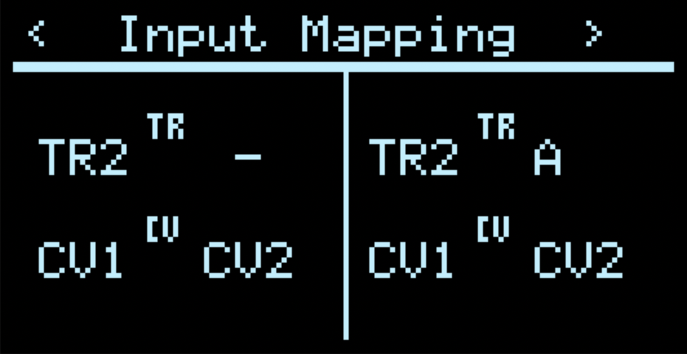
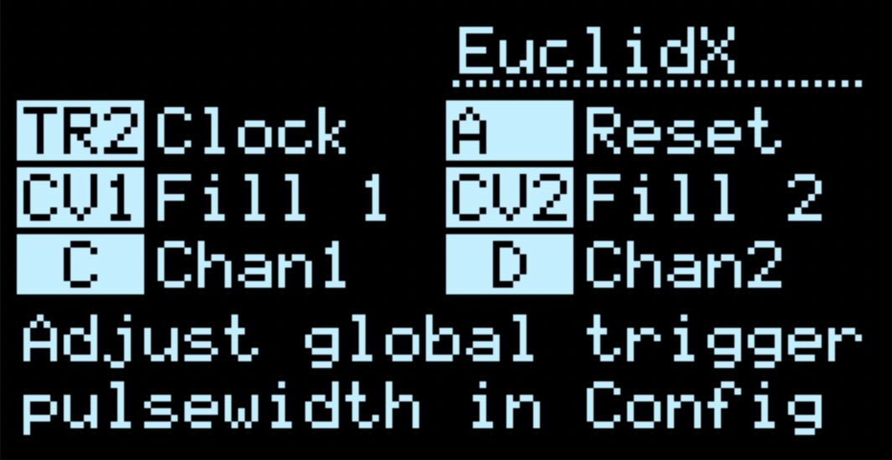
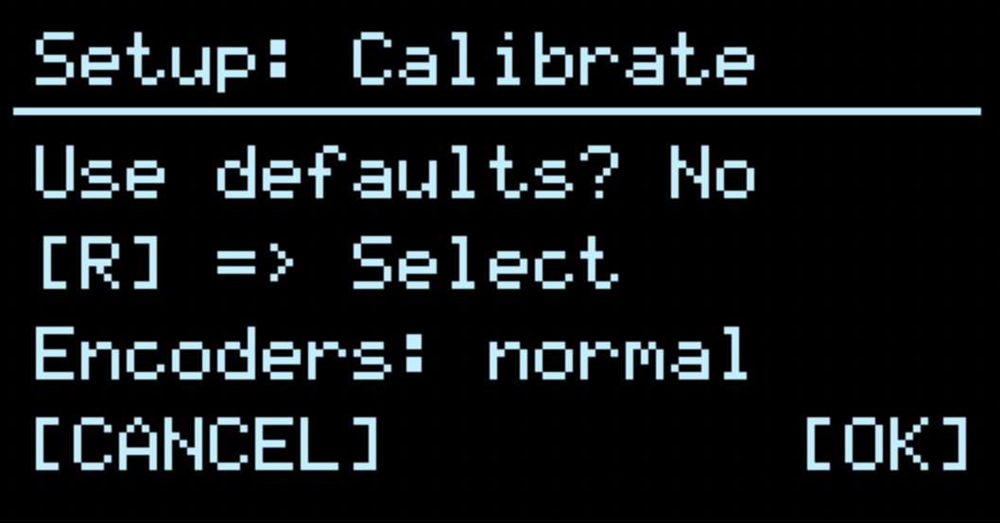
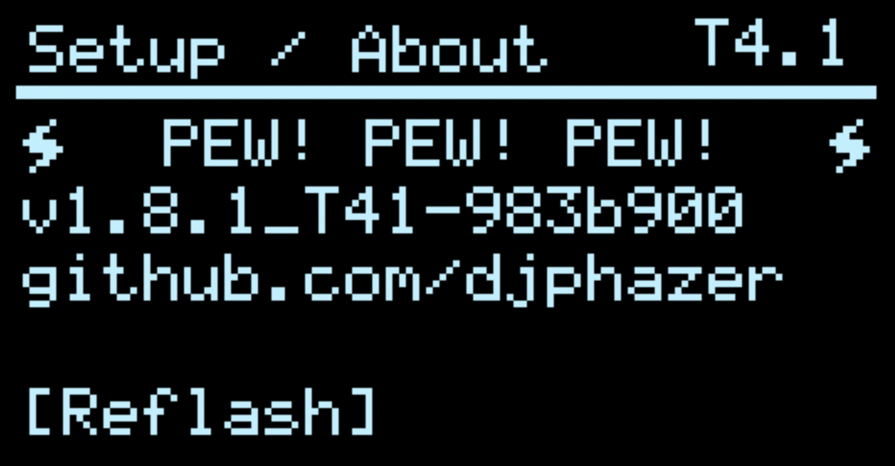

# Frequently Asked Questions

1. [Input & output mapping](#io)
2. [Clock sync](#clock)
3. [Internal clock](#int-clock)
4. [Quantizer engines](#quantizers)
5. [Calibration](#calibration)
6. [Encoder direction](#encoders)
7. [How can I reflash the firmware without unscrewing the module from my rack?](#ezflash)

## Q1: How do the physical input and output jacks relate to the apps / applets? <a id='io'>

A: Within Hemisphere, any of the physical input jacks (trigger/gate and CV) may be flexibly [mapped](Hemisphere-Input-Mapping) to any of 4 virtual (software) inputs of each applet. The output jacks of each applet are hardcoded to A/B (Left Hemisphere) & C/D (Right Hemisphere), and these outputs may also be routed to the virtual inputs.

Using the [Input mapping screen](Hemisphere-Input-Mapping), you can configure applets to share Triggers or CV sources, directly route the output of one applet as the input of another, or disable (mute) a physical input jack.

**NOTE: Some full screen apps (those other than the original stock apps) will respect the current input mapping saved within Hemisphere. Within full screen apps, the name displayed for a given input corresponds to its _software_ destination (i.e. its position within the Input Mapping Config)**

The input mapping above reflects the traditional default behaviour of O_C: Left and Right Hemispheres with independent digital and CV inputs, corresponding to their physical jack locations on most 8hp hardware.

In the example above, the input mapping reflects an alternative behaviour: both Left and Right Hemispheres map TR2 to their 1st virtual digital input (which in many cases will be used for clock). The 2nd virtual digital input is disabled for the Left Hemisphere, and for the Right Hemisphere it is the 1st output of the Left Hemisphere (Output A). In this case, both Hemispheres share control voltage inputs CV1 and CV2.

You may map physical Digital inputs to virtual CV inputs and vice versa.

Within Hemisphere, each applet's help screen will dynamically label the physical input and output jacks currently mapped to each parameter. Trigger inputs may also be remapped via the [Clock Setup screen](Clock-Setup)

## Q2: How does external clock sync work? <a id='clock'>

A: See the [Clock Setup screen](Clock-Setup)

An external clock may be used to set tempo in Hemisphere, either from:
- Triggers sent to TR1 (hardcoded to the physical input)
- MIDI input clock

When the clock is armed, the next trigger at TR1 will start the clock. MIDI run/stop messages will be respected.

While playing, Hemisphere will automatically detect the incoming tempo, and stop automatically when pulses cease.

The `Sync` parameter is PPQN (pulses per quarter note), or how many ticks of an external clock tick correspond to an internal clock tick.

After BPM detection, triggers are passed to applets according to their corresponding clock multiplication or division, with `Swing` (if enabled – % parameter is editable under `BPM`)

To disable external clock sync, set `Sync` to 0

**NOTE: when clock pulses are recieved at both TR1 and MIDI, the result is simply mixed, potentially resulting in an unstable BPM detection**

## Q3 How do I trigger applets from the internal clock? <a id='int-clock'>

A: See the [Clock Setup screen](Clock-Setup)

You can forward internal clock pulses (or multiples / divisions thereof) to any trigger destination. Dual press UP+DOWN buttons to access the clock menu, and adjust the div/mult for each trigger destination. By default, each destination is blank (x0) and will ignore the internal clock.

## Q4: What is the deal with the quantizer engines? <a id='quantizers'>

A: Instead of single, individual quantizers built into each applet, applets now share access to pool of 8 quantizer engines (Q1 - Q8) which can be configured in either a pop-up window, or in the [configuration menu](Hemisphere-Quantizer-Setup). Each quantizer engine includes a root note, scale, octave adjustment, and note mask.

To switch between quantizer engines in an applet, select the quantizer parameter for editing and adjust with the LEFT or RIGHT encoder, depending on hemisphere context. Some applets allow CV modulation of quantizer engine, with semitone modulation resolution. While selecting, a black pop-up window will be visible.

To edit the active quantizer engine in an applet, select the quantizer parameter for editing and press the Aux Button: UP or DOWN depending on hemisphere context. This will open an inverted (white) pop-up window. Use the LEFT encoder to select the Quantizer parameter to edit, and adjust with the RIGHT encoder. The first parameter of the note mask is a rotation value. Press UP to raise the octave, or press DOWN to lower it.

Or, see the [configuration menu](Hemisphere-Quantizer-Setup) to edit all 8 engines.

## Q5: How do I calibrate the hardware? <a id='calibration'>

A: See the app [Setup/About](Setup-About)

## Q6: My encoders are going the wrong way! How do I change them? <a id='encoders'>

A: If your encoders don't rotate the way you expect, you can flip the behaviour of one, the other, or both as part of the [Setup / About](Setup-About) calibration routine.

After selecting "Calibrate" in Setup / About (short press of LEFT encoder), press either the UP and DOWN buttons to choose your encoder reversal: L, R, both (LR), or neither (normal) — press the RIGHT encoder to accept.

If you want to use non-default calibration, you will need to scroll through the entire calibration routine to save the encoder reversal setting (rotate LEFT encoder to the last page, press RIGHT encoder to save).

## Q7: Do I have to take the module out of my rack every time I want to update the firmware? <a id='ezflash'>

A: Not if you are updating from Phazerville v1.8.1 or later! If so, you can reflash without accessing the button at the back of the module (so long as you have a USB connection)

To do so:

1. Navigate to the Setup / About App
2. Turn the LEFT encoder — the display should read “Reflash”

3. Press the LEFT encoder to enter Flash Upgrade Mode, and proceed with the remaining instructions
4. Open the [Teensy Loader](https://www.pjrc.com/teensy/loader.html) application on your computer
5. Drag and drop the desired .hex file onto the Teensy Loader application
6. Within the Teensy Loader click the Program icon, or choose Program from the Operation menu
5. You should briefly see a progress bar as the firmware is uploaded
6. Within the Teensy Loader, click the reboot icon or choose Operation > Reboot
7. The module should restart with your new firmware, without ever having to touch a screwdriver
