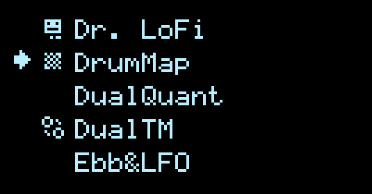

# Applet Filtering

## Page 4: Applet Filtering

The fourth and final full-screen page in the [config menu](Hemisphere-Config) is for Applet Filtering.

Are you tired of scrolling past applets you never use? Now you can hide them with this filter!

_This setting is now saved in v1.8._

This is a full list of all the applets. RIGHT encoder push will toggle visibility of the selected applet, indicated by a unique icon. LEFT encoder push inverts the entire list. When an applet is hidden (no icon), it is simply skipped when switching applets on the main view.
