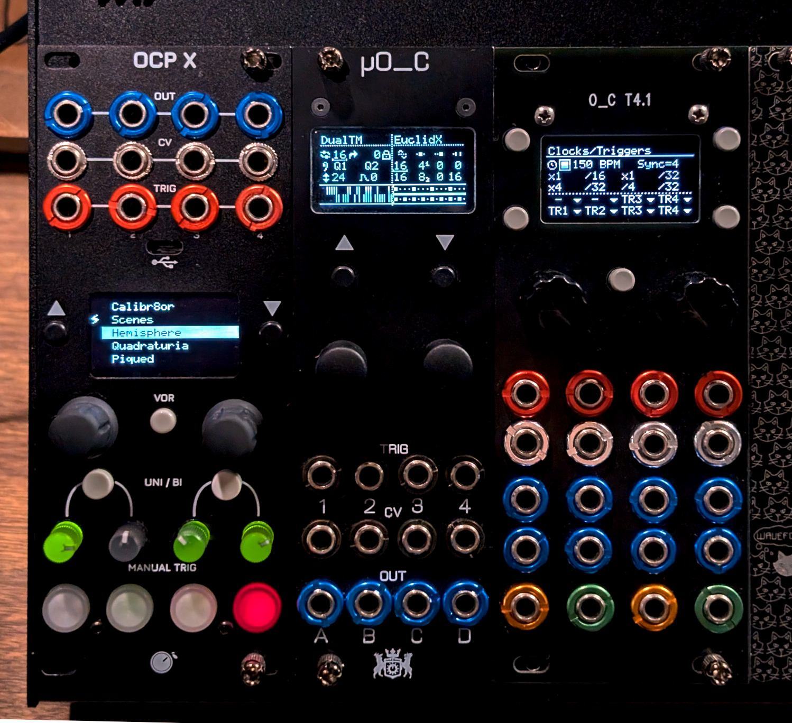

# Phazerville Suite
#### _Note from the Mayor:_
> Thanks for checking out my firmware. I've basically tried to hoard all the notable Apps and Applets in one repo! All the full-screen apps from [Hemisphere Suite](https://github.com/Chysn/O_C-HemisphereSuite/wiki) are here, plus all of the [stock O&C firmware](https://ornament-and-cri.me/user-manual-v1_3/) apps and a few new ones, albeit in limited combinations depending on which .hex file you grabbed from the [Release page](https://github.com/djphazer/O_C-Phazerville/releases).
> 
> Want to roll your own mix of Apps? You can request a **Custom Build** for Teensy 3.2 with a simple bot command on [this discussion post](https://github.com/djphazer/O_C-Phazerville/discussions/38).
> 
> Read a bit about my [Development Philosophy](Development-Philosophy) to understand my motives behind this project.
> 
> &mdash; _[DJ Phazer](https://ko-fi.com/djphazer)_

## Key Features:
* More apps now fit on the same hardware (you can even [choose your own selection](https://github.com/djphazer/O_C-Phazerville/discussions/38))
* Many new and improved [Hemisphere applets](App-and-Applet-Index#hemisphere-applets)
* New full screen apps: [Scenes](Scenes), [Calibr8or](Calibr8or), and [Passencore](Passencore)
* New UI features, codebase optimizations, and QoL improvements
    * [Hemisphere Presets](Hemisphere-Presets) — with auto save and loading via MIDI program changes
    * [Trigger and CV Input re-mapping](Hemisphere-Input-Mapping) (including internal routing)
    * [Internal clock improvements](Clock-Setup): swing, per-channel multiplication / division, manual performance triggers
    * [Global per-channel quantization](Hemisphere-Quantizer-Setup) (with pop-up editor and performance transposition)
    * Intuitive USB MIDI In clock sync
    * Experimental [automatic USB MIDI Out](Hemisphere-General-Settings#auto-midi-output)
* And [someday very soon](https://ko-fi.com/djphazer): Next-gen hardware powered by Teensy 4.1

***

## Quick Links

You can find links to documentation for (almost) every single O_C function on this page, or on the sidebar.

**[Full PDF Manual 𝌆](https://drive.google.com/file/d/1QP3Erpp_vNS32l7JN_-60KhtBQsRg5HM/view)** compiled by Saverio Paiella (July 22, 2024)

↯ [Download a **Release**](https://github.com/djphazer/O_C-Phazerville/releases) or ᛃ [Request a **Custom Build**](https://github.com/djphazer/O_C-Phazerville/discussions/38).

⧉ **[Index of all Apps and Applets](App-and-Applet-Index)**

#### Installation
* [Firmware update procedure](Installation)
* [Build choices](Build-Choices)
* [Saving state](Saving-State)
* [Troubleshooting](Troubleshooting)

#### Hemisphere docs:

* [Gestures / Button combos](Hemisphere-Gestures)
* [Clock Setup](Clock-Setup)
* [Config Menu](Hemisphere-Config)
    * [Save / Load Presets](Hemisphere-Presets)
    * [General Settings](Hemisphere-General-Settings)
    * [Quantizer Set-Up](Hemisphere-Quantizer-Setup)
    * [Input Mapping](Hemisphere-Input-Mapping)
    * [Applet Filtering](Hemisphere-Applet-Filtering)

***

## New to Ornament and Crime?

**_Ornament and Crime_** is a Polymorphic CV Generator — a swiss army knife of modular control voltage. It can perform as an _excellent_ sequencer, envelope generator, quantizer, MIDI-to-CV and/or CV-to-MIDI interface, and [much more](App-and-Applet-Index#apps-and-applets-by-function) via its many apps and applets.

**_o_C_** is a **collaborative open-source project** originated by [Patrick Dowling, mxmxmx, and Tim Churches](https://ornament-and-cri.me/), and extended by many contributors (special thanks to [Chysn](https://github.com/Chysn/O_C-HemisphereSuite) for the original Hemisphere Suite). The **_Phazerville_** firmware optimizes the code base so that more apps can fit on the original hardware (which come in many flavours, for Eurorack and otherwise — _See [Build Choices](Build-Choices)_), and paves the way for the next generation of hardware on the Teensy 4.1 platform.

Each of the [full screen apps](App-and-Applet-Index#full-screen-apps) takes advantage of all inputs and outputs in their own way, which is usually configurable. _**Hemisphere**_ splits the screen into two halves: each side available to load any one of [a long list of applets](App-and-Applet-Index). On o_C hardware with inputs and outputs arranged in 3 rows of 4 columns (i.e. most 8hp units), the I/O corresponding to an applet should be in line with that half of the display. If you're coming from any of the other Hemisphere forks, note that many of the applets have been upgraded for additional flexibility and functionality, and several are brand new.

***

_Note: Some apps, Hemisphere applets, and parameter editing contexts use special behaviour for the various encoders, buttons, and encoder buttons, which **should** be noted somewhere in these docs. If your encoders don't rotate the way you expect, you can flip the behaviour of one, the other, or both as part of the [Setup / About](Setup-About) calibration routine. See [Hemisphere Gestures](Hemisphere-Gestures) for all button combos within Hemisphere._
